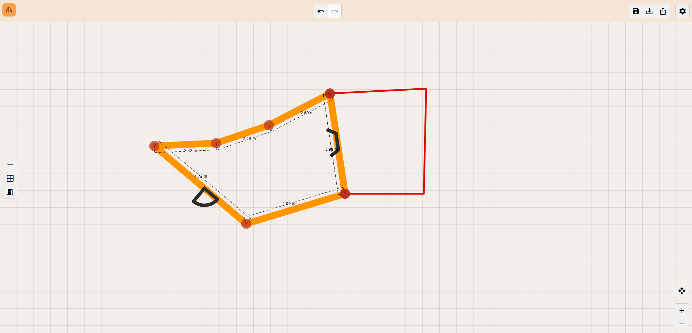

# HomePlanner

HomePlanner is a web application built with Angular that enables users to design and customize their own home layouts. With intuitive controls and a variety of features, users can create detailed floor plans, place structural elements and export their designs. HomePlanner provides the tools you need to bring your vision to life.

## Features

### Wall placement and customization

- **Place walls**: easily draw walls to define rooms. 
- **Wall customization**: change wall colors and thickness to match your design preferences. 
- **Angle snap**: automatically snap walls at 45-degree angles for precise drawing. 
- **Grid background**: a grid assists with accurate placement and alignment of elements.

### Structural Elements

- **Doors and windows**: add doors and windows to your walls, then adjust their placement as needed. 
- **Rotation**: rotate doors and windows to fit your design. 
- **Removal**: remove unwanted doors and windows. 
- **Quick actions**: right-click on elements to access quick hand actions for efficient editing.

### Advanced Editing

- **Move elements**: move rooms, walls or corners to refine your layout. 
- **Split walls**: divide a wall into two separate segments.
- **Hide walls**: temporarily hide walls to better visualize other parts of your layout. 
- **Units display**: units are displayed while drawing walls for precise measurement.

### Navigation and Viewing

- **Interactive environment**: move around your design naturally to get different perspectives.
- **Zoom**: navigate your layout with zooming capabilities, using buttons or scrolling.

### Undo/Redo

- **Undo/redo actions**: easily undo or redo actions to correct mistakes or revisit previous designs.

### Export

- **Export design**: export your finished floor plan under **JSON** or **PNG** format for sharing or further use.
- **Import design**: import a shared or previously saved design.

## Technical

This project was generated with [Angular CLI](https://github.com/angular/angular-cli) version 17.0.0.

### Development server

Run `ng serve` for a dev server. Navigate to `http://localhost:4200/`. The application will automatically reload if you change any of the source files.

### Code scaffolding

Run `ng generate component component-name` to generate a new component. You can also use `ng generate directive|pipe|service|class|guard|interface|enum|module`.

### Build

Run `ng build` to build the project. The build artifacts will be stored in the `dist/` directory.

### Running unit tests

Run `ng test` to execute the unit tests via [Karma](https://karma-runner.github.io).

### Running end-to-end tests

Run `ng e2e` to execute the end-to-end tests via a platform of your choice. To use this command, you need to first add a package that implements end-to-end testing capabilities.

### Further help

To get more help on the Angular CLI use `ng help` or go check out the [Angular CLI Overview and Command Reference](https://angular.io/cli) page.
